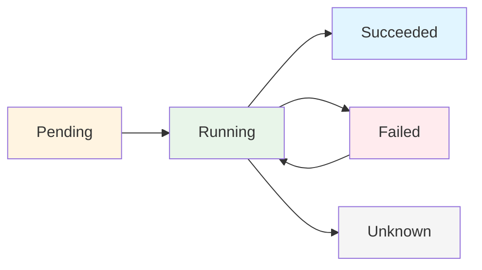

# Core Concepts

## Kubernetes Object Model

Everything in Kubernetes is an **object**. Objects are persistent entities that represent the state of your cluster.

### Object Structure

Every Kubernetes object has two main parts:

1. **Spec** - Desired state (what you want)
2. **Status** - Actual state (what Kubernetes observes)

Kubernetes continuously works to match the actual state to your desired state.

```yaml
apiVersion: v1
kind: Pod
metadata:
  name: my-pod
spec: # Desired state
  containers:
    - name: nginx
      image: nginx
status: # Actual state (managed by Kubernetes)
  phase: Running
```

---

## Fundamental Concepts

### 1. Clusters

A **cluster** is a set of machines (nodes) running containerized applications managed by Kubernetes.

```
┌──────────────────────────────────────────────────┐
│              KUBERNETES CLUSTER                   │
├──────────────────────────────────────────────────┤
│                                                   │
│  ┌─────────────────┐      ┌─────────────────┐  │
│  │  CONTROL PLANE  │      │   WORKER NODES   │  │
│  │                 │      │                  │  │
│  │  - API Server   │◄────►│  - Node 1        │  │
│  │  - Scheduler    │      │  - Node 2        │  │
│  │  - Controller   │      │  - Node 3        │  │
│  │  - etcd         │      │                  │  │
│  └─────────────────┘      └─────────────────┘  │
│                                                   │
└──────────────────────────────────────────────────┘
```

**Key Points:**

- Minimum 1 node (development) to 5000+ nodes (production)
- Control plane manages the cluster
- Worker nodes run your applications

---

### 2. Nodes

A **node** is a machine (physical or virtual) that runs containerized applications.

#### Types of Nodes

**Control Plane Nodes** (Master Nodes)

- Run cluster control components
- Make scheduling decisions
- Manage cluster state

**Worker Nodes**

- Run application workloads (Pods)
- Managed by control plane
- Report status back to control plane

#### Node Components

```
┌─────────────────────────────────┐
│        WORKER NODE              │
├─────────────────────────────────┤
│                                 │
│  ┌──────────────────────────┐  │
│  │       kubelet            │  │  ← Node agent
│  └──────────────────────────┘  │
│                                 │
│  ┌──────────────────────────┐  │
│  │    Container Runtime     │  │  ← Runs containers
│  │  (Docker/containerd)     │  │
│  └──────────────────────────┘  │
│                                 │
│  ┌──────────────────────────┐  │
│  │      kube-proxy          │  │  ← Network proxy
│  └──────────────────────────┘  │
│                                 │
│  ┌──────────────────────────┐  │
│  │        Pods              │  │  ← Your apps
│  └──────────────────────────┘  │
│                                 │
└─────────────────────────────────┘
```

**View nodes:**

```bash
kubectl get nodes
kubectl describe node <node-name>
```

---

### 3. Namespaces

**Namespaces** provide logical isolation for resources. Think of them as virtual clusters within a physical cluster.

#### Default Namespaces

| Namespace         | Purpose                                                   |
| ----------------- | --------------------------------------------------------- |
| `default`         | Default namespace for objects with no namespace specified |
| `kube-system`     | System components (DNS, dashboard, etc.)                  |
| `kube-public`     | Resources visible to all users                            |
| `kube-node-lease` | Node heartbeat information                                |

#### When to Use Namespaces

✅ Multiple teams using the same cluster
✅ Different environments (dev, staging, prod)
✅ Resource isolation and quotas
✅ Access control boundaries

#### Namespace Commands

```bash
# List namespaces
kubectl get namespaces

# Create namespace
kubectl create namespace dev
kubectl create namespace prod

# Switch context to namespace
kubectl config set-context --current --namespace=dev

# Get resources in specific namespace
kubectl get pods -n kube-system

# Get resources from all namespaces
kubectl get pods --all-namespaces
# or
kubectl get pods -A
```

#### Namespace YAML

```yaml
apiVersion: v1
kind: Namespace
metadata:
  name: development
  labels:
    name: development
    env: dev
```

---

### 4. Pods

**Pods** are the smallest deployable units in Kubernetes. A Pod represents a single instance of a running process.

#### Pod Characteristics

- Contains one or more containers
- Containers in a Pod share:
  - Network namespace (same IP)
  - Storage volumes
  - IPC namespace
- Scheduled together on the same node
- Have a unique IP address

#### Pod Lifecycle



**Pod Phases:**

- `Pending` - Accepted but not yet running
- `Running` - Pod bound to node, containers running
- `Succeeded` - All containers terminated successfully
- `Failed` - All containers terminated, at least one failed
- `Unknown` - Pod state cannot be determined

#### Single Container Pod

```yaml
apiVersion: v1
kind: Pod
metadata:
  name: nginx-pod
  labels:
    app: nginx
spec:
  containers:
    - name: nginx
      image: nginx:1.21
      ports:
        - containerPort: 80
```

#### Multi-Container Pod

```yaml
apiVersion: v1
kind: Pod
metadata:
  name: multi-container-pod
spec:
  containers:
    - name: web
      image: nginx
      ports:
        - containerPort: 80

    - name: logger
      image: busybox
      command: ["sh", "-c", "tail -f /var/log/nginx/access.log"]
      volumeMounts:
        - name: logs
          mountPath: /var/log/nginx

  volumes:
    - name: logs
      emptyDir: {}
```

#### Pod Commands

```bash
# Create pod
kubectl run nginx --image=nginx

# Create pod from YAML
kubectl apply -f pod.yaml

# List pods
kubectl get pods
kubectl get pods -o wide

# Describe pod
kubectl describe pod nginx-pod

# View logs
kubectl logs nginx-pod
kubectl logs nginx-pod -c container-name  # Multi-container

# Execute command in pod
kubectl exec -it nginx-pod -- /bin/bash

# Delete pod
kubectl delete pod nginx-pod
```

---

### 5. Labels and Selectors

**Labels** are key-value pairs attached to objects for identification. **Selectors** are used to filter objects by labels.

#### Labels

```yaml
apiVersion: v1
kind: Pod
metadata:
  name: webapp
  labels:
    app: web
    environment: production
    tier: frontend
    version: v1.2.3
spec:
  containers:
    - name: nginx
      image: nginx
```

#### Selectors

**Equality-based:**

```bash
kubectl get pods -l environment=production
kubectl get pods -l tier!=backend
```

**Set-based:**

```bash
kubectl get pods -l 'environment in (production, staging)'
kubectl get pods -l 'tier notin (frontend)'
```

**Multiple conditions:**

```bash
kubectl get pods -l app=web,environment=production
```

#### Label Commands

```bash
# Show labels
kubectl get pods --show-labels

# Add label
kubectl label pod nginx-pod version=v1

# Update label
kubectl label pod nginx-pod version=v2 --overwrite

# Remove label
kubectl label pod nginx-pod version-
```

---

### 6. Annotations

**Annotations** are key-value pairs for non-identifying metadata. They don't affect object selection.

#### Use Cases

- Build/release information
- Timestamps
- Contact information
- Tool configurations

```yaml
apiVersion: v1
kind: Pod
metadata:
  name: annotated-pod
  annotations:
    build: "2023-10-15"
    git-commit: "abc123def456"
    maintained-by: "devops-team@example.com"
    description: "Production web server"
spec:
  containers:
    - name: nginx
      image: nginx
```

---

### 7. ReplicaSets

**ReplicaSets** ensure a specified number of pod replicas are running at any time.

#### ReplicaSet Diagram

```
┌───────────────────────────────────────┐
│         ReplicaSet                    │
│  Desired Replicas: 3                  │
├───────────────────────────────────────┤
│                                       │
│  ┌───────┐  ┌───────┐  ┌───────┐   │
│  │ Pod 1 │  │ Pod 2 │  │ Pod 3 │   │
│  └───────┘  └───────┘  └───────┘   │
│                                       │
│  Auto-healing: If Pod 2 crashes      │
│  ┌───────┐  ┌───────┐  ┌───────┐   │
│  │ Pod 1 │  │ Pod 4 │  │ Pod 3 │   │
│  └───────┘  └───────┘  └───────┘   │
│                                       │
└───────────────────────────────────────┘
```

#### ReplicaSet YAML

```yaml
apiVersion: apps/v1
kind: ReplicaSet
metadata:
  name: nginx-replicaset
spec:
  replicas: 3
  selector:
    matchLabels:
      app: nginx
  template:
    metadata:
      labels:
        app: nginx
    spec:
      containers:
        - name: nginx
          image: nginx:1.21
          ports:
            - containerPort: 80
```

#### ReplicaSet Commands

```bash
# Create ReplicaSet
kubectl apply -f replicaset.yaml

# Get ReplicaSets
kubectl get rs

# Scale ReplicaSet
kubectl scale rs nginx-replicaset --replicas=5

# Delete ReplicaSet
kubectl delete rs nginx-replicaset
```

⚠️ **Note:** ReplicaSets are rarely used directly. Use **Deployments** instead (covered in next section).

---

### 8. Deployments

**Deployments** provide declarative updates for Pods and ReplicaSets. They are the recommended way to manage applications.

#### Why Use Deployments?

- Rolling updates
- Rollback capability
- Pause and resume updates
- Version history
- Self-healing

#### Deployment Architecture

```
┌─────────────────────────────────────────┐
│           Deployment                     │
│    (Manages ReplicaSets)                │
├─────────────────────────────────────────┤
│                                          │
│  ┌──────────────────────────────────┐  │
│  │     ReplicaSet v1 (old)          │  │
│  │  ┌─────┐                          │  │
│  │  │Pod 1│ (scaling down)           │  │
│  │  └─────┘                          │  │
│  └──────────────────────────────────┘  │
│                                          │
│  ┌──────────────────────────────────┐  │
│  │     ReplicaSet v2 (new)          │  │
│  │  ┌─────┐ ┌─────┐ ┌─────┐        │  │
│  │  │Pod 1│ │Pod 2│ │Pod 3│        │  │
│  │  └─────┘ └─────┘ └─────┘        │  │
│  └──────────────────────────────────┘  │
│                                          │
└─────────────────────────────────────────┘
```

#### Basic Deployment

```yaml
apiVersion: apps/v1
kind: Deployment
metadata:
  name: nginx-deployment
  labels:
    app: nginx
spec:
  replicas: 3
  selector:
    matchLabels:
      app: nginx
  template:
    metadata:
      labels:
        app: nginx
    spec:
      containers:
        - name: nginx
          image: nginx:1.21
          ports:
            - containerPort: 80
```

#### Deployment Strategies

**Rolling Update** (Default)

```yaml
spec:
  strategy:
    type: RollingUpdate
    rollingUpdate:
      maxUnavailable: 1 # Max pods unavailable during update
      maxSurge: 1 # Max extra pods during update
```

**Recreate** (All at once)

```yaml
spec:
  strategy:
    type: Recreate
```

#### Deployment Commands

```bash
# Create deployment
kubectl create deployment nginx --image=nginx --replicas=3

# From YAML
kubectl apply -f deployment.yaml

# Get deployments
kubectl get deployments

# Describe deployment
kubectl describe deployment nginx-deployment

# Scale deployment
kubectl scale deployment nginx-deployment --replicas=5

# Update image (rolling update)
kubectl set image deployment/nginx-deployment nginx=nginx:1.22

# Check rollout status
kubectl rollout status deployment/nginx-deployment

# View rollout history
kubectl rollout history deployment/nginx-deployment

# Rollback to previous version
kubectl rollout undo deployment/nginx-deployment

# Rollback to specific revision
kubectl rollout undo deployment/nginx-deployment --to-revision=2

# Pause rollout
kubectl rollout pause deployment/nginx-deployment

# Resume rollout
kubectl rollout resume deployment/nginx-deployment

# Delete deployment
kubectl delete deployment nginx-deployment
```

---

## Practice Exercises

### Exercise 1: Create a Pod

```bash
# Create a pod running nginx
kubectl run my-nginx --image=nginx

# Verify it's running
kubectl get pods

# Get detailed information
kubectl describe pod my-nginx

# Delete the pod
kubectl delete pod my-nginx
```

### Exercise 2: Work with Namespaces

```bash
# Create a new namespace
kubectl create namespace test

# Create a pod in that namespace
kubectl run nginx --image=nginx -n test

# List pods in the namespace
kubectl get pods -n test

# Delete namespace (deletes all resources in it)
kubectl delete namespace test
```

### Exercise 3: Create a Deployment

```bash
# Create deployment
kubectl create deployment web --image=nginx --replicas=3

# Watch pods being created
kubectl get pods -w

# Scale up
kubectl scale deployment web --replicas=5

# Update image
kubectl set image deployment/web nginx=nginx:alpine

# Check rollout
kubectl rollout status deployment/web

# Rollback
kubectl rollout undo deployment/web

# Clean up
kubectl delete deployment web
```

---

## Key Takeaways

1. **Pods** are the basic execution unit; rarely created directly
2. **ReplicaSets** maintain pod replicas; use Deployments instead
3. **Deployments** are the standard way to run applications
4. **Namespaces** provide logical isolation
5. **Labels** and **Selectors** are used for grouping and filtering
6. Everything in Kubernetes is an **object** with spec and status

---

## Next Steps

👉 **[04-architecture.md](./04-architecture.md)** - Deep dive into Kubernetes architecture

## Quick Reference

| Command                              | Description             |
| ------------------------------------ | ----------------------- |
| `kubectl get <resource>`             | List resources          |
| `kubectl describe <resource> <name>` | Detailed info           |
| `kubectl apply -f <file>`            | Create/update from YAML |
| `kubectl delete <resource> <name>`   | Delete resource         |
| `kubectl logs <pod>`                 | View pod logs           |
| `kubectl exec -it <pod> -- <cmd>`    | Execute command in pod  |
