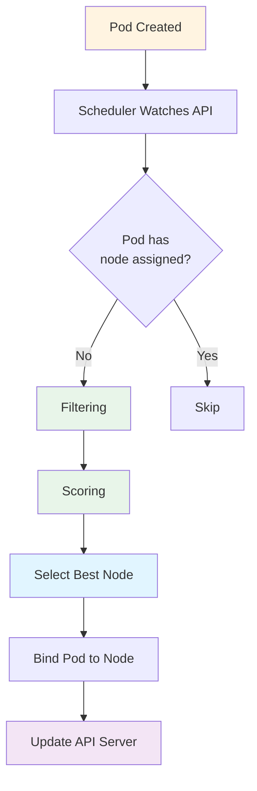

# Kubernetes Architecture Deep Dive

## Overview

Kubernetes follows a master-worker architecture with a clear separation between the control plane (master) and worker nodes.

## High-Level Architecture

```
┌──────────────────────────────────────────────────────────────────┐
│                    KUBERNETES CLUSTER                            │
└──────────────────────────────────────────────────────────────────┘

┌─────────────────────────────────┐
│       CONTROL PLANE              │
│  ┌────────────────────────────┐ │
│  │     kube-apiserver         │ │ ← API Gateway
│  └────────────────────────────┘ │
│  ┌────────────────────────────┐ │
│  │     etcd                   │ │ ← Key-Value Store
│  └────────────────────────────┘ │
│  ┌────────────────────────────┐ │
│  │     kube-scheduler         │ │ ← Pod Scheduler
│  └────────────────────────────┘ │
│  ┌────────────────────────────┐ │
│  │   kube-controller-manager  │ │ ← Controllers
│  └────────────────────────────┘ │
│  ┌────────────────────────────┐ │
│  │   cloud-controller-manager │ │ ← Cloud Integration
│  └────────────────────────────┘ │
└─────────────────────────────────┘
              │
              │ (API Calls)
              ▼
┌─────────────────────────────────┐
│        WORKER NODES             │
│                                  │
│  ┌────────────────────────────┐ │
│  │     kubelet                │ │ ← Node Agent
│  └────────────────────────────┘ │
│  ┌────────────────────────────┐ │
│  │     kube-proxy             │ │ ← Network Proxy
│  └────────────────────────────┘ │
│  ┌────────────────────────────┐ │
│  │  Container Runtime         │ │ ← Docker/containerd
│  │  ┌──────┐ ┌──────┐        │ │
│  │  │ Pod1 │ │ Pod2 │ ...    │ │
│  │  └──────┘ └──────┘        │ │
│  └────────────────────────────┘ │
└─────────────────────────────────┘
```

---

## Control Plane Components

The control plane makes global decisions about the cluster and detects/responds to cluster events.

### 1. kube-apiserver

**Purpose:** Front-end for the Kubernetes control plane. All communication goes through the API server.

**Functions:**

- Exposes Kubernetes API (REST)
- Validates and processes API requests
- Updates etcd with cluster state
- Authentication and authorization
- Admission control

**Key Points:**

- Only component that talks to etcd
- Stateless (can be horizontally scaled)
- Runs on control plane nodes
- Default port: 6443

**Communication Flow:**

```
kubectl → kube-apiserver → etcd
  ↑           ↓
  └───── Authentication & Authorization
```

**Example API Call:**

```bash
# Via kubectl
kubectl get pods

# Direct API call
curl -k https://localhost:6443/api/v1/pods \
  --header "Authorization: Bearer $TOKEN"
```

---

### 2. etcd

**Purpose:** Distributed key-value store that holds the entire cluster state.

**What It Stores:**

- All cluster data
- Configuration
- Secrets
- Service discovery info
- Node information
- Pod specifications

**Characteristics:**

- Consistent and highly-available
- Uses Raft consensus algorithm
- Only accessed by API server
- Can be run on separate machines
- Requires regular backups

**Data Structure:**

```
/registry/
  ├── pods/
  │   ├── default/
  │   │   ├── nginx-xxx
  │   │   └── app-yyy
  │   └── kube-system/
  ├── services/
  ├── deployments/
  └── secrets/
```

**etcd Operations:**

```bash
# Backup etcd (important!)
ETCDCTL_API=3 etcdctl snapshot save backup.db

# Restore etcd
ETCDCTL_API=3 etcdctl snapshot restore backup.db

# Check etcd health
ETCDCTL_API=3 etcdctl endpoint health
```

---

### 3. kube-scheduler

**Purpose:** Assigns newly created Pods to nodes based on resource requirements and constraints.

**Scheduling Process:**



**Scheduling Factors:**

- Resource requests (CPU, memory)
- Node affinity/anti-affinity
- Pod affinity/anti-affinity
- Taints and tolerations
- Data locality
- Hardware/software constraints

**Example Scheduling Constraints:**

```yaml
apiVersion: v1
kind: Pod
metadata:
  name: scheduled-pod
spec:
  # Node selector (simple)
  nodeSelector:
    disktype: ssd

  # Node affinity (advanced)
  affinity:
    nodeAffinity:
      requiredDuringSchedulingIgnoredDuringExecution:
        nodeSelectorTerms:
          - matchExpressions:
              - key: kubernetes.io/hostname
                operator: In
                values:
                  - node1
                  - node2

  # Resource requests
  containers:
    - name: nginx
      image: nginx
      resources:
        requests:
          memory: "64Mi"
          cpu: "250m"
        limits:
          memory: "128Mi"
          cpu: "500m"
```

---

### 4. kube-controller-manager

**Purpose:** Runs controller processes that regulate the state of the cluster.

**Built-in Controllers:**

| Controller                     | Function                                           |
| ------------------------------ | -------------------------------------------------- |
| **Node Controller**            | Monitors node health, responds to node failures    |
| **Replication Controller**     | Maintains correct number of pods                   |
| **Endpoints Controller**       | Populates Endpoints object (joins Services & Pods) |
| **Service Account Controller** | Creates default ServiceAccounts for namespaces     |
| **Job Controller**             | Runs Jobs to completion                            |
| **CronJob Controller**         | Runs Jobs on schedule                              |
| **DaemonSet Controller**       | Ensures pods run on all nodes                      |
| **Deployment Controller**      | Manages ReplicaSets                                |
| **StatefulSet Controller**     | Manages StatefulSets                               |

**Controller Loop:**

```
┌──────────────────────────────────┐
│     Controller Loop              │
├──────────────────────────────────┤
│                                   │
│  1. Watch API Server             │
│  2. Compare Desired vs Actual    │
│  3. Take Action if Different     │
│  4. Update Status                │
│  5. Repeat                        │
│                                   │
└──────────────────────────────────┘
```

**Example: Deployment Controller Flow:**

```
User creates Deployment
        ↓
Deployment Controller sees it
        ↓
Creates ReplicaSet
        ↓
ReplicaSet Controller sees it
        ↓
Creates Pods
        ↓
Scheduler assigns Pods to Nodes
        ↓
Kubelet starts containers
```

---

### 5. cloud-controller-manager

**Purpose:** Integrates Kubernetes with cloud provider APIs (AWS, Azure, GCP).

**Cloud-Specific Controllers:**

- **Node Controller:** Check cloud provider to determine if node has been deleted
- **Route Controller:** Set up routes in cloud infrastructure
- **Service Controller:** Create/update/delete cloud load balancers
- **Volume Controller:** Create/attach/mount cloud volumes

**Example Use Cases:**

- Create AWS ELB for LoadBalancer service
- Attach Azure disks as persistent volumes
- Update GCP routes for pod network

---

## Worker Node Components

Worker nodes run application workloads (Pods) and are managed by the control plane.

### 1. kubelet

**Purpose:** Agent that runs on each node; ensures containers are running in pods.

**Responsibilities:**

- Watches API server for pod assignments
- Ensures pod containers are running and healthy
- Reports node and pod status
- Executes container probes (liveness, readiness, startup)
- Mounts volumes
- Downloads secrets

**Communication:**

```
kube-apiserver
       ↓ (Pod spec)
    kubelet
       ↓
  Container Runtime (Docker/containerd)
       ↓
   Running Containers
```

**Kubelet Configuration:**

```yaml
# /var/lib/kubelet/config.yaml
apiVersion: kubelet.config.k8s.io/v1beta1
kind: KubeletConfiguration
address: 0.0.0.0
authentication:
  webhook:
    enabled: true
clusterDNS:
  - 10.96.0.10
clusterDomain: cluster.local
```

---

### 2. kube-proxy

**Purpose:** Network proxy that maintains network rules for pod communication.

**Functions:**

- Implements Kubernetes Service concept
- Maintains network rules (iptables/IPVS)
- Handles load balancing
- Enables service discovery

**Network Modes:**

**1. iptables Mode** (default)

```
Service Request → iptables rules → Random Pod
```

**2. IPVS Mode** (better performance)

```
Service Request → IPVS → Load Balanced → Pod
```

**3. userspace Mode** (legacy)

**Example iptables Rules:**

```bash
# View kube-proxy rules
sudo iptables -t nat -L KUBE-SERVICES

# Example rule for service
-A KUBE-SERVICES -d 10.96.0.1/32 -p tcp -m tcp --dport 443 \
  -j KUBE-SVC-NPX46M4PTMTKRN6Y
```

---

### 3. Container Runtime

**Purpose:** Software responsible for running containers.

**Supported Runtimes:**

- **containerd** (most common, Docker's runtime)
- **CRI-O** (lightweight OCI runtime)
- **Docker** (deprecated, but still works via containerd)

**Container Runtime Interface (CRI):**

```
kubelet → CRI → Container Runtime → Containers
```

---

## Add-ons

Optional components that provide cluster-level features.

### DNS (CoreDNS)

**Purpose:** Cluster DNS server for service discovery.

**Function:**

- Provides DNS names for services
- Enables service discovery
- Every service gets a DNS name: `<service>.<namespace>.svc.cluster.local`

**Example DNS Resolution:**

```bash
# Inside pod
nslookup kubernetes.default
# Returns: 10.96.0.1

nslookup nginx-service.production.svc.cluster.local
# Returns service ClusterIP
```

---

### Dashboard

**Purpose:** Web-based UI for managing cluster.

**Install:**

```bash
kubectl apply -f https://raw.githubusercontent.com/kubernetes/dashboard/v2.7.0/aio/deploy/recommended.yaml

# Access dashboard
kubectl proxy
# Visit: http://localhost:8001/api/v1/namespaces/kubernetes-dashboard/services/https:kubernetes-dashboard:/proxy/
```

---

### CNI Plugins (Network)

**Purpose:** Implement pod networking.

**Popular CNI Plugins:**

- **Calico** - Network policy support
- **Flannel** - Simple overlay network
- **Weave Net** - Easy to set up
- **Cilium** - eBPF-based networking

---

### Metrics Server

**Purpose:** Collects resource metrics for autoscaling.

**Install:**

```bash
kubectl apply -f https://github.com/kubernetes-sigs/metrics-server/releases/latest/download/components.yaml

# View metrics
kubectl top nodes
kubectl top pods
```

---

## Communication Flows

### 1. Creating a Deployment

```
1. User: kubectl create deployment nginx --image=nginx
           ↓
2. kubectl: Sends request to kube-apiserver
           ↓
3. API Server: Validates, authenticates, writes to etcd
           ↓
4. Deployment Controller: Notices new deployment, creates ReplicaSet
           ↓
5. ReplicaSet Controller: Creates Pod specs
           ↓
6. Scheduler: Assigns Pods to Nodes
           ↓
7. Kubelet: Sees Pod assignment, starts containers
           ↓
8. kube-proxy: Updates network rules
           ↓
9. Pod Running!
```

### 2. Service Request Flow

```
External Request
        ↓
    LoadBalancer / NodePort
        ↓
   kube-proxy (iptables/IPVS)
        ↓
    Service (ClusterIP)
        ↓
    Pod 1, Pod 2, or Pod 3
```

---

## High Availability Architecture

For production, run multiple control plane nodes:

```
┌─────────────────────────────────────────────────┐
│            LOAD BALANCER                        │
│         (HAProxy / nginx)                       │
└─────────────────────────────────────────────────┘
          │          │          │
    ┌─────┘          │          └─────┐
    ▼                ▼                ▼
┌────────┐      ┌────────┐      ┌────────┐
│ Master │      │ Master │      │ Master │
│  Node  │      │  Node  │      │  Node  │
│   1    │      │   2    │      │   3    │
└────────┘      └────────┘      └────────┘
    │                │                │
    └────────────────┴────────────────┘
                     │
              ┌──────┴──────┐
         ┌────▼────┐   ┌────▼────┐   ┌────▼────┐
         │  etcd   │   │  etcd   │   │  etcd   │
         │  Node   │   │  Node   │   │  Node   │
         │    1    │   │    2    │   │    3    │
         └─────────┘   └─────────┘   └─────────┘
```

**Benefits:**

- No single point of failure
- Load distribution
- Zero-downtime upgrades

---

## Practice: Explore Your Cluster

```bash
# View all components
kubectl get componentstatuses

# Check control plane pods
kubectl get pods -n kube-system

# View API server
kubectl cluster-info

# Check node information
kubectl get nodes -o wide

# View all API resources
kubectl api-resources

# Check API versions
kubectl api-versions

# Describe node details
kubectl describe node <node-name>
```

---

## Key Takeaways

1. **Control Plane** manages the cluster state
2. **API Server** is the central communication hub
3. **etcd** stores all cluster data
4. **Scheduler** assigns Pods to Nodes
5. **Controllers** maintain desired state
6. **kubelet** is the node agent running on each worker
7. **kube-proxy** handles networking
8. Everything communicates through the **API Server**

---

## Next Steps

👉 **[05-kubectl-guide.md](./05-kubectl-guide.md)** - Master the kubectl command-line tool

## Additional Resources

- [Kubernetes Components Documentation](https://kubernetes.io/docs/concepts/overview/components/)
- [Understanding the Kubernetes API](https://kubernetes.io/docs/concepts/overview/kubernetes-api/)
- [etcd Documentation](https://etcd.io/docs/)
